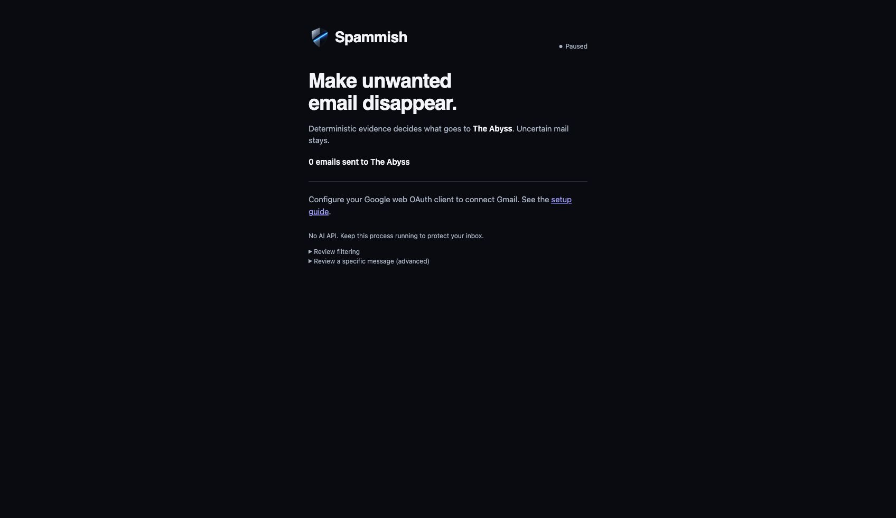

# Spammish

## Make unwanted email disappear.

Spammish watches Gmail and moves mail that earns enough **deterministic, explainable evidence** to **The Abyss**. Cold outreach, unwanted promotions, obvious spam and other qualifying automated mail. Real relationships and important legitimate mail receive strong protection.

Wrong decision? **Rescue it.** The message returns to Inbox and Spammish records a narrow, local correction.

**Free forever. Open source. MIT. No AI API.**

## Install with your AI builder

Give [this repository](https://github.com/nickfrench-gtm/spammish) to Codex, Claude Code, Cursor or another capable coding agent:

> Install Spammish locally and get it ready to protect my Gmail. Follow AGENTS.md and docs/agent-install.md. Configure and verify everything you can; walk me through only steps requiring my Google authorization. Preserve existing credentials and never print secrets.

The repo includes [AGENTS.md](AGENTS.md), a [step-by-step installation contract](docs/agent-install.md), `setup`, `doctor`, and a shared desktop/browser worker. The AI builder helps install it; **it does not need to stay running**.

**0.4.0 is a source release.** You currently need your own applicable Google OAuth client. An agent can assist configuration; the human completes Google sign-in and consent. There is no public signed/notarized Mac installer or frictionless Spammish-managed OAuth flow yet. Those are future distribution improvements, not source-release requirements.

## Manual install

Primary qualified path: macOS/Linux local browser worker, Node **22.13+** (24 recommended).

```sh
git clone https://github.com/nickfrench-gtm/spammish.git
cd spammish
npm ci --ignore-scripts
npm run setup
```

Create your own **Web application** OAuth client with Gmail API enabled and the redirect `http://127.0.0.1:8080/auth/callback`. Configure permitted Google test users as applicable, then:

```sh
npm run setup -- --web-client /absolute/path/to/downloaded-client.json
npm run doctor
npm start
```

Open **http://127.0.0.1:8080**, connect Gmail, and complete Google's consent yourself. From another terminal, `npm run doctor -- --json` verifies setup, runtime, stored connection, recent authorization and enabled worker state. [Full Google configuration and recovery instructions](docs/agent-install.md). [Optional desktop source app](docs/development.md).



*Current source interface with no mailbox connected; no private data.*

## What it does

- Checks the existing Inbox on connection, then polls new arrivals. Cleanup resumes after interruptions.
- Supports multiple Gmail accounts with isolated credentials, history, corrections and Pause/Disconnect controls.
- Moves qualifying messages to the recoverable **The Abyss** label, removing only Inbox. Read/unread state and other labels remain unchanged.
- Shows one lifetime total: confirmed emails sent to The Abyss, with recent reasons available under Review filtering. Older desktop moves are not guessed.
- Implements no sending, replying, trashing, deletion, link clicking, unsubscribing, summaries or general inbox dashboard.

## How it works

Message features + mailbox relationship evidence + your corrections → **Spammish Score** → protective gates → Inbox or The Abyss.

Evidence includes sender/domain familiarity, prior outbound communication, actual thread participation, commercial/promotional language, outreach CTAs, verified unanswered sequences, bulk headers, locally inspected tracking/calendar URLs, Spam-labeled history and explicit corrections.

Current automatic threshold: **70**, with corroboration requirements and hard protections. Existing relationships, important transactional/account messages, Rescue feedback and incomplete content can keep a message in Inbox even with a high score. **Score ≠ probability.** [Inspect the model and limitations](docs/detection.md).

This is broader than a B2B-only filter, but it is not a blanket category cleaner. A social-network notification, newsletter or promotion does **not** qualify merely because of its category. Legitimate subscription context is protected. Other messages need sufficient supported evidence; conservative misses are intentional. Spammish does not know your preferences magically.

## The Abyss and Rescue

Gmail has Inbox and Spam. Spammish adds a recoverable destination for mail its own evidence model says should leave normal Inbox attention; Gmail does not have to call it spam.

**Abyss:** move missed unwanted mail to The Abyss in Gmail while Spammish is enabled. This records narrow exact-sender rejection evidence. The core exposes an explicit Abyss method as well.

**Rescue:** use Review filtering → Rescue, or move a recorded message back to Inbox. It retracts that sender's rejection and strongly protects it. A later explicit Abyss can supersede that protection. One correction never blocks or whitelists an entire domain. Own automatic moves do not reinforce themselves as explicit rejection.

## Why Spammish

Local, deterministic, explainable and correctable. No AI bill, maintainer-funded classifier, telemetry, paid gate or subscription. The complete core is MIT and free forever; forks can extend it at their operators' responsibility.

It started with B2B cold email: “It isn't technically spam. We don't care.” That remains an example of the larger purpose: **make unwanted email disappear**.

## Privacy and permissions

Bodies are inspected transiently on your machine. Attachments and remote images are not fetched; message URLs are never visited. No mailbox content is sent to an AI provider or maintainer. Local state retains credentials, checkpoints, counts, narrow hashed feedback/receipts and bounded recent decision records, not bodies. Desktop tokens use OS encryption; the browser worker encrypts its saved state with a private local vault key. Protect your machine and key.

Only **gmail.modify** is requested. Google's grant technically permits broader operations, including sending. Spammish implements no send/reply/trash/delete operation. Do not confuse a code boundary with a narrower OAuth capability. [Privacy](PRIVACY.md) · [Security and private reporting](SECURITY.md).

## Limitations and verification

Keep Spammish running on an awake, online computer. Closing the browser is fine; stopping Node stops filtering. The desktop window can close while its menu-bar worker remains running; Quit stops it.

Gmail delivers before Spammish polls, so mail or notifications may appear before filtering. Large inboxes take time, and Google throttling can delay checks. No claim of perfect detection, complete spam coverage, calibrated probability or numerical accuracy is made.

[0.4.0 acceptance record](docs/acceptance-0.4.0.md): controlled real-Gmail integration, existing-mail observations, and explicitly labeled injected failure/recovery boundaries. This is not a representative accuracy benchmark or public installer certification.

```sh
npm test
npm run check
npm audit
```

## Contributing and license

[Contributing](CONTRIBUTING.md) · [MIT License](LICENSE) · [Maintainer release guide](docs/releasing.md).

These descriptions apply to the published default source. Third-party modifications are their authors'/operators' responsibility; see the license's warranty and liability terms. Please use synthetic examples in issues, never private mail or credentials.

The [website](https://spammish.fly.dev) links to OSS and a Cloud waitlist. No Chrome extension or Cloud service is included in this source release.
